# SpecOps: Specification-Driven Legacy System Modernization

> AI is going to change the game on legacy system modernization, but maybe not in the way you think.


## What is SpecOps?

SpecOps is a methodology for using AI to modernize legacy government systems by focusing on knowledge preservation and verified specifications rather than direct code translation.

Traditional AI-assisted modernization tries to transpile legacy code directly into modern languages. SpecOps uses AI to compile institutional knowledge into comprehensive, human-verified specifications that become the authoritative source of truth for system behavior.

**Bottom line**: The specification is more valuable than the code. It captures institutional knowledge, enables domain expert verification, and outlasts any particular technical implementation.

---

## Why SpecOps?

### The Problem with Direct Translation

When AI translates legacy software to modern software stacks automatically:
- ❌ Errors in understanding get embedded in new code
- ❌ Domain experts can't verify technical implementations
- ❌ Institutional knowledge remains locked in code
- ❌ No artifact exists if experts become available later

### The SpecOps Approach

When AI generates specifications first, then modern code:
- ✅ Domain experts verify specifications before any code is written
- ✅ Institutional knowledge is preserved in readable form
- ✅ Specifications outlast implementations and guide future changes
- ✅ Multiple stakeholders can review using natural language
- ✅ Changes flow through specifications with proper oversight

---

## Core Principles

1. **The Specification is the Source of Truth** - Like GitOps treats Git as authoritative for infrastructure, SpecOps treats specifications as authoritative for system behavior

2. **Knowledge Preservation Precedes Translation** - Capture and verify what the system does before building replacements

3. **Domain Experts Are the Arbiters** - Policy and business stakeholders verify specifications, not code

4. **AI Assists, Humans Verify** - AI excels at analysis and generation; humans excel at judgment and verification

5. **Changes Flow Through Specifications** - All modifications start with specification updates, reviewed and approved before implementation

6. **Specifications Should Be Accessible** - Readable by domain experts while detailed enough to guide implementation

---

## How It Works

```mermaid
graph TB
    A[📜 Legacy Code] --> B[🤖 AI Analysis]
    B --> C[📋 Draft Specification]
    C --> D{👥 Domain Expert<br/>Verification}
    D -->|Revisions Needed| C
    D -->|Approved| E[✅ Verified Specification<br/>⭐ Source of Truth ⭐]
    E --> F[🤖 AI Code Generation]
    F --> G[💻 Modern Implementation]
    G --> H[🧪 Testing Against<br/>Specification]
    H -->|Tests Pass| I[🚀 Production Deployment]
    H -->|Tests Fail| F
    
    style E fill:#90EE90,stroke:#2E8B57,stroke-width:3px
    style D fill:#FFE4B5,stroke:#FF8C00,stroke-width:2px
    style I fill:#87CEEB,stroke:#4682B4,stroke-width:2px
```



**Key Insight**: The specification remains valuable forever. Updated code is just the current implementation.

---

## Documentation

### 📋 [Manifesto](public/MANIFESTO.md)
The foundational principles and philosophy of SpecOps. Why specifications are the valuable artifact, and how this approach differs from traditional modernization. Start here to understand the core ideas.

### 🔄 [Comparison Framework](public/COMPARISON.md)
Detailed comparison of SpecOps vs. direct translation and traditional modernization across 11 dimensions. Shows when each approach is appropriate and why SpecOps excels for government systems. Read this to understand the trade-offs.

### 🛠️ [Core Tools](public/CORE-TOOLS.md)
The technical infrastructure needed for SpecOps: specification repositories, AI agent instruction sets, verification tools, and change management systems. Use this to set up your toolchain.

### 📖 [Methodology](public/METHODOLOGY.md)
Step-by-step guide through all six phases of SpecOps: Discovery, Specification Generation, Verification, Implementation, Testing, and Deployment. Includes integration with the Strangler Fig pattern for incremental modernization. Follow this to execute SpecOps.

### 👥 [Team Structure](public/TEAM.md)
Roles, responsibilities, and staffing guidance for a SpecOps modernization project. Covers team sizes from minimum viable (8-10 people) to full-scale (12-18 people), with specific job descriptions and success metrics. Use this to build your team.

### 💡 [Instruction Set Examples](public/INSTRUCTION-SETS.md)
Guide to creating and sharing AI agent instruction sets (skills) that enable SpecOps. Includes examples for COBOL comprehension, specification generation, and domain-specific knowledge. Emphasizes collaboration and cross-government sharing. Read this to build your instruction library.

### 🚧 [Reference Implementation](public/REFERENCE-IMPLEMENTATION.md)
_(In Development)_ A complete, working example of SpecOps applied to a real legacy system. Will provide reusable artifacts, templates, and lessons learned. Check back for practical examples.

---

## Key Benefits

### For Government Agencies

**Knowledge Preservation**
- Capture institutional knowledge before experts retire
- Create lasting documentation that outlives any implementation
- Preserve understanding of policy decisions and edge cases

**Risk Reduction**
- Domain experts verify behavior before code is written
- Errors caught early, when they're cheapest to fix
- Clear audit trail of what changed and why

**Better Outcomes**
- Specifications ensure modern systems implement policy correctly
- Stakeholders can meaningfully participate in verification
- Changes managed with proper oversight

**Sustainable Modernization**
- Incremental approach via Strangler Fig pattern
- Value delivered continuously, not just at project end
- Foundation for future modernization efforts

### For Technology Teams

**AI as Force Multiplier**
- AI handles tedious legacy code analysis
- AI generates code from clear specifications
- AI reduces manual effort while improving quality

**Clear Success Criteria**
- Specifications define when implementations are "correct"
- Testing against specifications is straightforward
- Less ambiguity about requirements

**Reusable Knowledge**
- Instruction sets can be shared across projects
- Specification patterns apply to multiple systems
- Community collaboration reduces duplication

---

## When to Use SpecOps

SpecOps is particularly effective when:

- ✅ Legacy system is poorly documented
- ✅ Institutional knowledge is at risk of being lost
- ✅ Business logic is complex and critical to get right
- ✅ Domain experts are available but can't verify code
- ✅ Long-term knowledge preservation is valuable
- ✅ Incremental modernization over years is expected
- ✅ System behavior must be auditable and explainable

SpecOps may not be necessary when:

- ⚠️ Legacy system is well-understood and well-documented
- ⚠️ Business logic is simple and stable
- ⚠️ Speed is prioritized over accuracy
- ⚠️ Comprehensive test coverage already exists

---

## Getting Started

### 1. Read the Core Documents
- Start with the [Manifesto](MANIFESTO.md) to understand the philosophy
- Review the [Comparison Framework](COMPARISON.md) to see if SpecOps fits your context
- Study the [Methodology](METHODOLOGY.md) to understand the process

### 2. Assess Your Situation
- Do you have domain experts available for verification?
- Is institutional knowledge at risk?
- Can you commit to incremental modernization?
- Do you have or can you acquire the necessary tools?

### 3. Start Small
- Select a pilot component (moderate complexity, known behavior)
- Prove the approach in your environment
- Refine tools and workflows
- Build team capability
- Demonstrate value to stakeholders

### 4. Scale Up
- Work through prioritized components incrementally
- Build library of specifications and instruction sets
- Share knowledge across your organization
- Contribute to the broader community

---

## Contributing

SpecOps is a community-driven approach. We welcome contributions of:

- Instruction Sets: AI agent skills for legacy platforms, languages, or domains
- Experience Reports: Lessons learned from applying SpecOps
- Tool Integrations: How to use SpecOps with different AI coding tools
- Templates and Examples: Reusable artifacts for specifications and processes
- Documentation Improvements: Clarifications, corrections, and enhancements

**See [CONTRIBUTING.md](CONTRIBUTING.md) for detailed guidelines on how to contribute.**

For instruction set contributions specifically, see [INSTRUCTION-SETS.md](public/INSTRUCTION-SETS.md) for examples and guidance.

---

## Community

SpecOps is designed to enable collaboration across government agencies and the civic tech community.

**Sharing Instruction Sets**: Technical patterns and AI instructions are highly portable across organizations. A COBOL comprehension skill works whether you're modernizing benefits in California or taxes in New York.

**Cross-Government Collaboration**: Many governments face identical legacy modernization challenges. Pooling resources and sharing instruction sets reduces duplicated effort.

**Open Source by Design**: All SpecOps documentation and instruction sets should be freely shareable to maximize reuse and adaptation.

[Community resources and contact information TBD]

---

## About

SpecOps was developed to address the unique challenges of government legacy system modernization: aging systems, retiring workforce, complex business rules, and the need to preserve institutional knowledge while embracing modern technology.

The methodology combines proven practices from incremental modernization (Strangler Fig pattern), infrastructure as code (GitOps), and specification-driven development, adapted for the era of AI-assisted software development.

The goal: Make legacy modernization more effective, sustainable, and knowledge-preserving for everyone.

---

## License

SpecOps is released under the [MIT License](LICENSE). This permissive open source license allows you to freely use, modify, and share this methodology and documentation across government agencies and organizations.

---

## Citation

If you use SpecOps in your work or research, please cite:

```
SpecOps: Specification-Driven Legacy System Modernization
https://github.com/[your-org]/specops
```

---

**SpecOps: Because the knowledge is what matters. Everything else is implementation details.**